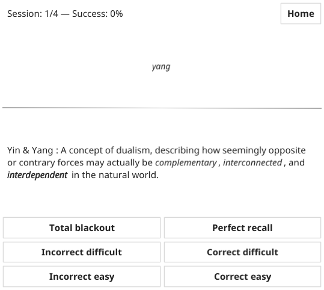
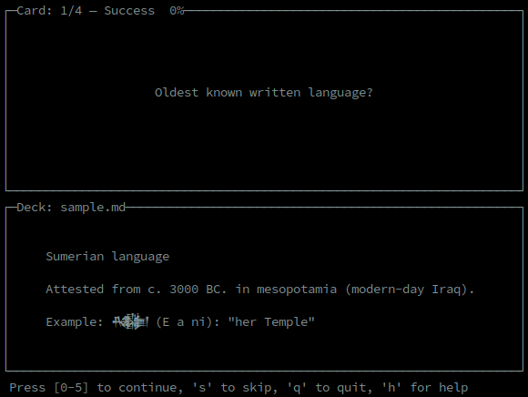

# Essentialist

Programs for [spaced repetition][1] using flashcards in [Markdown][2].

- **Essentialist**: a GUI for desktops and mobiles (Android and iOS)
- **Flashdown**: a terminal application

The space repetition algorithm used is based on [SM-2][3].

Key features:

- **No cloud**: Your data never leave your device.
- **Markdown**: Flash cards are plain text Markdown files.
- **Keyboard shortcut**: Minimalist interface with keyboard navigation.

Similar project: <https://github.com/Yvee1/hascard>.

[1]: https://en.wikipedia.org/wiki/Spaced_repetition
[2]: https://en.wikipedia.org/wiki/Markdown
[3]: https://en.wikipedia.org/wiki/SuperMemo#Description_of_SM-2_algorithm

## Essentialist (GUI)

A GUI version for desktops and mobile (Android, iOS support isn't tested).

> :warning: UTF-8 and Markdown tables are not yet supported.



### Desktop installation

```shell
go install ./cmd/essentialist
essentialist
```

### Android installation

```shell
cd cmd/essentialist
fyne package -os android
adb install Essentialist.apk
```

Use the local storage (of your Android device) to import flash cards. For
example, you can put them in an SD card and import them from the Essentialist
application.

## Flashdown (terminal version)

Flashdown is the terminal application.

To install it, clone this repo and run:

```shell
go install ./cmd/flashdown
```

Usage:

```shell
flashdown <deck_file> [<deck_file>]
```

This will automatically create an hidden file `.<deck file>.db` with
the recorded scores.



## Flash cards syntax

Save and edit your flash cards with in a Markdown file (with a `.md` extension
like `my_deck.md`). Each card starts with a heading level 1 (line starting with `#`) defining the question. The answer is the content following.

Here is a short file representing a deck with 3 cards:

```markdown
# Question: what format is used?

Questions and answers are in **Markdown**.

# Are lists supported?

Yes, here is an example:

- one
- **two**
- three

# How to include a table in the answer?

Answer with a table.

|  A  |  B  |
| --- | --- |
| 124 | 456 |
```
